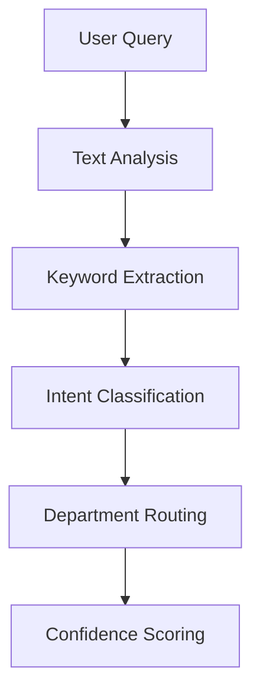
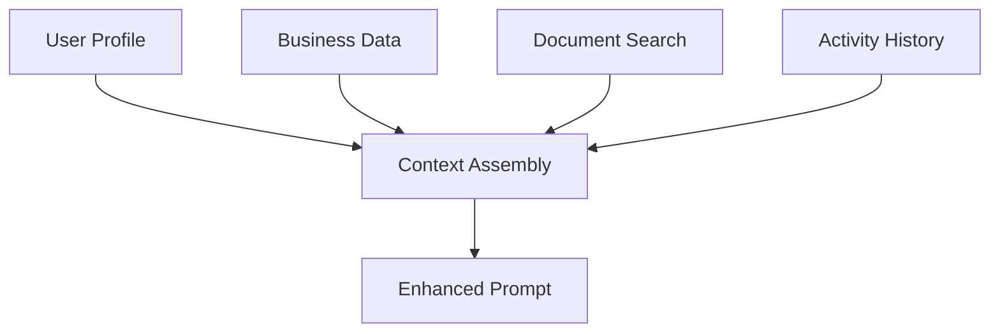
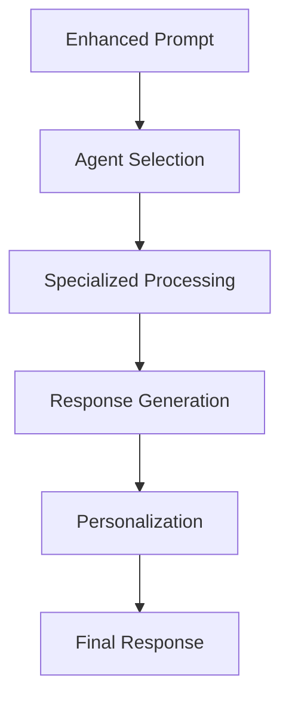

# 🧠 RAG System Architecture

## Overview

The **Retrieval Augmented Generation (RAG)** system is the intelligence backbone of Nexus AI assistants, transforming them from generic chatbots into data-driven business experts. This document outlines the architectural principles, core concepts, and system design that enable the "Nexus gets me" experience.

## 🏗️ **System Architecture**

```
┌─────────────────┐    ┌──────────────────┐    ┌─────────────────┐
│   User Query    │───▶│  ContextualRAG   │───▶│ Expert Response │
│                 │    │                  │    │                 │
│ "How are sales  │    │ • User Context   │    │ "Based on your │
│  performing?"   │    │ • Dept Data      │    │  $1.85M pipeline│
│                 │    │ • Intelligence   │    │  and 87% quota  │
└─────────────────┘    │ • Routing Logic  │    │  attainment..." │
                       └──────────────────┘    └─────────────────┘
                                │
                    ┌───────────▼───────────┐
                    │    Business Data      │
                    │                       │
                    │ • Sales Pipeline      │
                    │ • Marketing Metrics   │
                    │ • Financial Data      │
                    │ • Operations Status   │
                    └───────────────────────┘
```

## 🔧 **Core Components**

### **1. Contextual Intelligence Engine**
- **Location**: `src/lib/ai/contextualRAG.ts`
- **Purpose**: Deep contextual understanding of user interactions
- **Key Features**:
  - Enhanced user profiling with business context
  - Communication style adaptation
  - Role-based response personalization
  - Success criteria alignment

### **2. Vector-Based Document Retrieval**
- **Location**: `server/src/edge-functions/ai_chat.js`, `src/lib/services/cloudStorageRAG.ts`
- **Purpose**: Semantic document search and retrieval
- **Key Features**:
  - OpenAI text-embedding-3-small model integration
  - PostgreSQL pgvector similarity search
  - Multi-format document processing
  - Real-time cloud storage sync

### **3. Multi-Dimensional Data Integration**
- **Location**: `src/lib/ai/contextualRAG.ts`, business data services
- **Purpose**: Unified business intelligence layer
- **Key Features**:
  - Real-time metrics from sales, marketing, finance, operations
  - Integration data from HubSpot, Stripe, Google Analytics
  - User activity and behavioral analytics
  - Cross-platform correlation analysis

### **4. Intelligent Query Routing**
- **Location**: `src/lib/ai/contextualRAG.ts` (analyzeQueryRouting method)
- **Purpose**: Automatic expert assignment for queries
- **Key Features**:
  - Keyword-based classification
  - Confidence scoring
  - Department-specific routing
  - Fallback to executive assistant

### **5. Hierarchical Agent Architecture**
- **Location**: `src/lib/chatContext.ts`, agent definitions
- **Purpose**: Three-tier expert system
- **Structure**:
  - **Tier 1**: Executive Assistant (strategic oversight)
  - **Tier 2**: Department Heads (specialized knowledge)
  - **Tier 3**: Specialists (technical expertise)

## 📊 **Data Architecture**

### **User Context Schema**
```typescript
interface EnhancedUserContext {
  profile: {
    role: string;                    // Business role and responsibilities
    department: string;              // Organizational department
    experience_level: string;        // Technical proficiency level
    communication_style: string;     // Preferred response format
    primary_responsibilities: string[];
    current_pain_points: string[];
    immediate_goals: string;
  };
  business_context: {
    company_name: string;
    industry: string;
    growth_stage: string;            // startup | growth | enterprise
    automation_maturity: string;     // Technology adoption level
    key_tools: string[];            // Connected business systems
  };
  success_criteria: {
    primary_success_metric: string;
    time_savings_goal: string;
    roi_expectation: string;
  };
}
```

### **Department Data Schema**
```typescript
interface DepartmentData {
  sales: {
    pipeline_value: number;
    deals_closing_this_month: number;
    quota_attainment: number;
    top_opportunities: OpportunityData[];
    team_performance: PerformanceMetrics;
  };
  marketing: {
    campaign_performance: CampaignData[];
    lead_generation: LeadMetrics;
    website_analytics: AnalyticsData;
  };
  finance: {
    revenue: RevenueData;
    expenses: ExpenseData;
    cash_flow: CashFlowData;
    key_metrics: FinancialKPIs;
  };
  operations: {
    projects: ProjectData;
    system_health: SystemMetrics;
    team_utilization: UtilizationData;
  };
}
```

### **Vector Storage Schema**
```sql
-- Document vector storage
CREATE TABLE ai_vector_documents (
  id UUID PRIMARY KEY DEFAULT uuid_generate_v4(),
  document_id TEXT UNIQUE,
  content TEXT,
  content_embedding vector(1536),
  metadata JSONB,
  created_at TIMESTAMP DEFAULT NOW()
);

-- Vector similarity search function
CREATE FUNCTION match_documents(
  query_embedding vector(1536),
  match_threshold float,
  match_count int
) RETURNS TABLE (
  id UUID,
  content TEXT,
  similarity float
);
```

## 🔍 **Processing Flow**

### **1. Query Analysis**


### **2. Context Assembly**


### **3. Response Generation**


## 🎯 **Routing Logic**

### **Query Classification Algorithm**
```typescript
// Sales indicators
const salesKeywords = ['sales', 'pipeline', 'deals', 'revenue', 'quota'];
if (containsKeywords(query, salesKeywords)) {
  return { agent: 'sales', confidence: 0.9 };
}

// Marketing indicators  
const marketingKeywords = ['marketing', 'campaigns', 'leads', 'conversion'];
if (containsKeywords(query, marketingKeywords)) {
  return { agent: 'marketing', confidence: 0.88 };
}

// Executive indicators
const executiveKeywords = ['strategy', 'priorities', 'growth', 'vision'];
if (containsKeywords(query, executiveKeywords)) {
  return { agent: 'executive', confidence: 0.85 };
}
```

### **Confidence Scoring**
- **High Confidence (0.8-1.0)**: Clear departmental indicators
- **Medium Confidence (0.6-0.8)**: Contextual clues present
- **Low Confidence (0.4-0.6)**: Route to executive assistant
- **Very Low (<0.4)**: Default fallback handling

## 🔄 **Integration Points**

### **Chat System Integration**
- **Location**: `src/lib/chatContext.ts`
- **Method**: `buildEnhancedSystemPrompt()`
- **Purpose**: Inject RAG context into AI conversations

### **Cloud Storage Integration**
- **Services**: Google Drive, OneDrive, Dropbox
- **Processing**: Automatic document sync and indexing
- **Storage**: Vector embeddings in PostgreSQL

### **Business System Integration**
- **CRM**: HubSpot, Salesforce
- **Analytics**: Google Analytics, Mixpanel
- **Financial**: Stripe, QuickBooks
- **Communication**: Slack, Microsoft Teams

## 📈 **Performance Architecture**

### **Performance Targets**
- **Context Generation**: < 1 second
- **Query Processing**: < 300ms
- **Vector Search**: < 500ms
- **Response Generation**: < 1.5 seconds

### **Optimization Strategies**
- **Caching**: Embedding cache for frequent queries
- **Indexing**: Optimized vector search indices
- **Parallel Processing**: Concurrent data fetching
- **Lazy Loading**: On-demand data retrieval

### **Scalability Design**
- **Horizontal Scaling**: Stateless processing nodes
- **Database Optimization**: Read replicas for queries
- **CDN Integration**: Static asset delivery
- **Queue Management**: Background processing

## 🔒 **Security Architecture**

### **Data Protection**
- **Encryption**: AES-256 for data at rest
- **Transport Security**: TLS 1.3 for data in transit
- **Access Control**: Row-level security (RLS)
- **Audit Logging**: Comprehensive activity tracking

### **Privacy Compliance**
- **GDPR**: Right to erasure, data portability
- **CCPA**: Consumer privacy rights
- **SOC 2**: Security and availability controls
- **HIPAA**: Healthcare data protection (where applicable)

### **Input Validation**
- **XSS Prevention**: Content sanitization
- **SQL Injection**: Parameterized queries
- **Rate Limiting**: API request throttling
- **Content Filtering**: Inappropriate content detection

## 🧪 **Testing Architecture**

### **Test Coverage**
- **Unit Tests**: Core functionality validation
- **Integration Tests**: System interaction verification
- **Performance Tests**: Benchmark compliance
- **Security Tests**: Vulnerability assessment

### **Test Automation**
- **Continuous Integration**: Automated test execution
- **Regression Testing**: Change impact validation
- **Load Testing**: Performance under stress
- **Monitoring**: Real-time health checks

## 🚀 **Deployment Architecture**

### **Environment Strategy**
- **Development**: Local testing environment
- **Staging**: Production-like validation
- **Production**: Live system deployment
- **Disaster Recovery**: Backup and failover

### **Infrastructure**
- **Cloud Provider**: Multi-region deployment
- **Container Orchestration**: Kubernetes/Docker
- **Load Balancing**: Traffic distribution
- **Auto-scaling**: Dynamic resource allocation

## 🔮 **Future Architecture**

### **Planned Enhancements**
- **Real-time Learning**: Adaptive response improvement
- **Multi-modal Processing**: Voice, image, video integration
- **Advanced Analytics**: Predictive business insights
- **Custom Models**: Domain-specific AI training

### **Scalability Roadmap**
- **Multi-tenant Architecture**: Enterprise customer support
- **API Gateway**: Third-party integration platform
- **Event-driven Architecture**: Real-time data processing
- **Microservices**: Component independence

## 📚 **Related Documentation**

- [RAG System Implementation Guide](../implementation/RAG_SYSTEM_INTEGRATION.md)
- [AI Capabilities Summary](../implementation/AI_CAPABILITIES_SUMMARY.md)
- [Component Architecture](./COMPONENT_ARCHITECTURE.md)
- [Nexus Complete Operating System](./NEXUS_COMPLETE_OPERATING_SYSTEM.md)

---

The RAG system architecture represents a sophisticated approach to business AI, combining contextual intelligence, semantic search, and personalized communication to create an assistant that truly understands and serves business needs. 