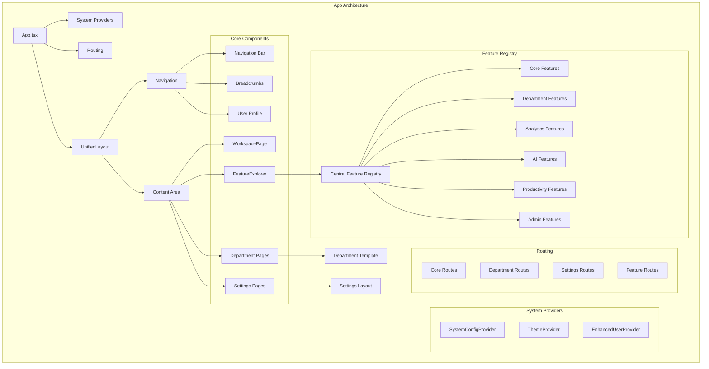

# Nexus Unified Architecture

This document outlines the unified architecture for the Nexus platform, designed to create a coherent and consistent user experience across all product modules.

## Core Principles

1. **Hub and Spoke Model**: Centralized navigation with context-aware secondary navigation
2. **Consistent UI Patterns**: Standardized templates and patterns across departments
3. **Feature Discovery**: Centralized feature registry for discoverability
4. **Contextual Relevance**: Presenting the right tools at the right time
5. **Visual Consistency**: Cohesive visual language across all modules

## Key Components

### 1. Unified Layout (`UnifiedLayout.tsx`)

The `UnifiedLayout` component serves as the primary layout wrapper for the entire application, implementing the hub and spoke model with:

- Global sidebar navigation (the hub)
- Contextual secondary navigation
- Breadcrumbs for hierarchical navigation
- User profile and context
- Responsive design for all devices

### 2. Workspace Hub (`WorkspacePage.tsx`)

The `WorkspacePage` component serves as the personalized central hub for each user, featuring a dynamic, widget-based dashboard that includes:

- AI-driven insights and proactive alerts
- A comprehensive calendar view
- Task and idea management
- A unified inbox for communications
- Quick access to recent and favorite items

### 3. Feature Registry (`featureRegistry.tsx`)

The feature registry provides a central, structured way to register and discover platform features:

- Categorized feature definitions
- Access control integration
- Search functionality
- Related feature suggestions
- Documentation linking

### 4. Feature Explorer (`FeatureExplorer.tsx`)

The Feature Explorer component helps users discover functionality:

- Browse features by category
- Search for specific features
- Filter by access level
- Pin favorites for quick access
- See recommendations

### 5. Department Template (`DepartmentTemplate.tsx`)

A standardized template for department pages providing consistent layouts:

- Department header with title, description, and actions
- Key metrics display
- Tabbed interface for different views
- Standardized search and filters

### 6. Settings Layout (`SettingsLayout.tsx`)

A consistent layout for all settings pages:

- Sidebar navigation for settings categories
- Visual hierarchy of settings
- Permission-based display
- Section-based organization

### 7. System Configuration (`SystemConfigContext.tsx`)

Centralized configuration management:

- Feature flags
- Environment-specific settings
- Branding configuration
- API endpoints
- Language and localization

### 8. Theme Management (`ThemeContext.tsx`)

Unified theme management across the application:

- Light/dark mode support
- System preference detection
- Persistent user preferences
- Dynamic theme switching

## Implementation Architecture

The architecture follows a layered approach:

1. **Providers Layer**: Core context providers for system-wide state
   - `SystemConfigProvider`
   - `ThemeProvider`
   - `EnhancedUserProvider`

2. **Layout Layer**: Structural components for application layout
   - `UnifiedLayout`
   - `DepartmentTemplate`
   - `SettingsLayout`

3. **Feature Layer**: Components that implement business functionality
   - Department pages
   - Settings pages
   - Feature-specific components

4. **UI Component Layer**: Reusable UI components
   - Cards, buttons, inputs, etc.
   - Data display components
   - Form components

## Benefits

This unified architecture provides several benefits:

1. **Improved User Experience**: Consistent interface reduces cognitive load
2. **Higher Productivity**: Related tools are contextually grouped
3. **Better Feature Discovery**: Users can find features more easily
4. **Faster Onboarding**: Consistent patterns are easier to learn
5. **Development Efficiency**: Standardized components speed up development
6. **Maintenance Simplicity**: Common patterns are easier to maintain

## Implementation Roadmap

1. **Phase 1**: Core layout and navigation
   - Unified layout structure
   - Global navigation
   - Workspace hub

2. **Phase 2**: Templates and patterns
   - Department templates
   - Settings layout
   - Common UI patterns

3. **Phase 3**: Feature registry and discovery
   - Feature definitions
   - Feature explorer
   - Search and discovery

4. **Phase 4**: Context providers
   - System configuration
   - Theme management
   - Enhanced user context

5. **Phase 5**: Department implementations
   - Sales department
   - Finance department
   - Operations department

## Architecture Diagram

## Conclusion

The unified architecture creates a cohesive experience across all Nexus modules, making the platform more intuitive, efficient, and maintainable. By implementing consistent patterns and centralized registries, both users and developers benefit from improved clarity and productivity. 