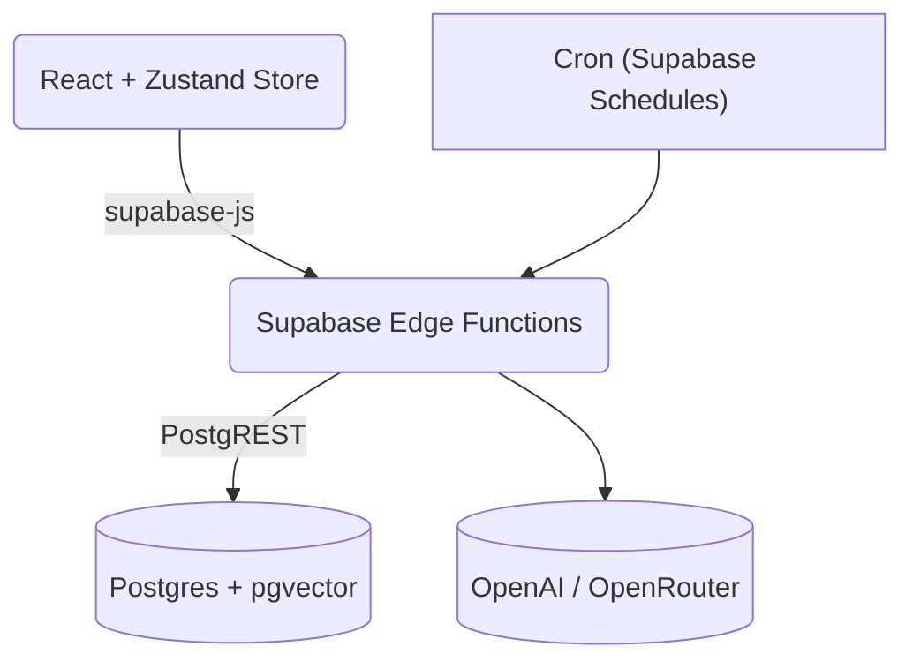

# Nexus – Automate the 20 % that eats 80 % of your day

**Pillar: 1,3,5**  <!-- Product, Architecture, Performance -->

Nexus is an automation OS that pulls together the scattered tools, data sources and chat interfaces already living in your company, then layers AI on top to surface insights and execute actions. All with **zero infrastructure to maintain** – we run entirely on Supabase Edge Functions, Postgres and modern browser tech.

---

## 1. Why Nexus?

| Pain Point | How Nexus Helps |
|------------|----------------|
| Too many dashboards & APIs | One gateway (Supabase) and a unified UI – no multiple back-ends, no Zap-spaghetti. |
| Data silos | Out-of-the-box connectors for Slack, HubSpot, Stripe, Google Analytics and more, with RLS-safe storage. |
| AI hype fatigue | We package practical agents: Executive Assistant, Operations Bot, Progressive Intelligence – each scoped to clear ROI metrics. |

---

## 2. Fast Start (5 minutes)

1. **Sign up / Log in** – Email, Passkey or Azure AD.
2. **Connect your first integration**
   ```
   → Settings → Integrations → "Connect Google Analytics"
   ```
3. **Ask anything** in the chat (`Cmd + K`).  Examples:
   * "Why did web revenue dip last week?"
   * "Summarise team Slack activity in 3 bullets."
4. **Create your first automation** – Trigger weekly KPI PDF to leadership over Slack.

> Tip: The AI will suggest actions contextually as you explore the app.

---

## 3. Under the Hood



* **Single gateway** – all network calls use `supabase.from`, `supabase.rpc` or `supabase.functions.invoke`.
* **Edge Functions** – OAuth handshakes, data sync workers, AI agents.
* **Postgres** – Source of truth + vector search (pgvector).
* **Cron jobs** – Metrics roll-ups, finance sync, email sync.

---

## 4. Adding a New Integration

1. **DB** – run the template migration (creates `ai_<provider>_…` tables + RLS).
2. **Edge Function** – `my-provider-oauth` for handshake, `my-provider-sync` for background pulls.
3. **Front-end** – Drop a React setup wizard in `src/components/integrations`.
4. **Done** – Metrics and insights appear automatically once data lands.

> Scaffold helpers: `pnpm mcp supabase scaffold integration <name>` (coming soon).

---

## 5. Security & Compliance

* Row-level security on every table.
* Secrets stored in Supabase Vault (or managed env vars for workers).
* Passkeys (WebAuthn) and 2FA out of the box.
* Audit logs in `ai_audit_logs`, query with `supabase.rpc('get_audit_logs')`.

---

## 6. Roadmap

| ETA | Feature | Pillar |
|-----|---------|--------|
| Q3 | No-code workflow builder | 1,3 |
| Q3 | SOC 2 Type II | 4 |
| Q4 | Marketplace for community agents | 1,5 |

> Follow progress on [github.com/marcoby/nexus](https://github.com/marcoby/nexus).

---

## 7. Contributing

1. Fork → `git clone`.
2. `pnpm install && pnpm dev` (web) **or** `supabase start` (functions).
3. All PRs must tag pillars in title (`Pillar: 3`).
4. Run tests & lints: `pnpm test && pnpm lint`.

---

© 2025–2026 Marcoby Tech.  All rights reserved. 