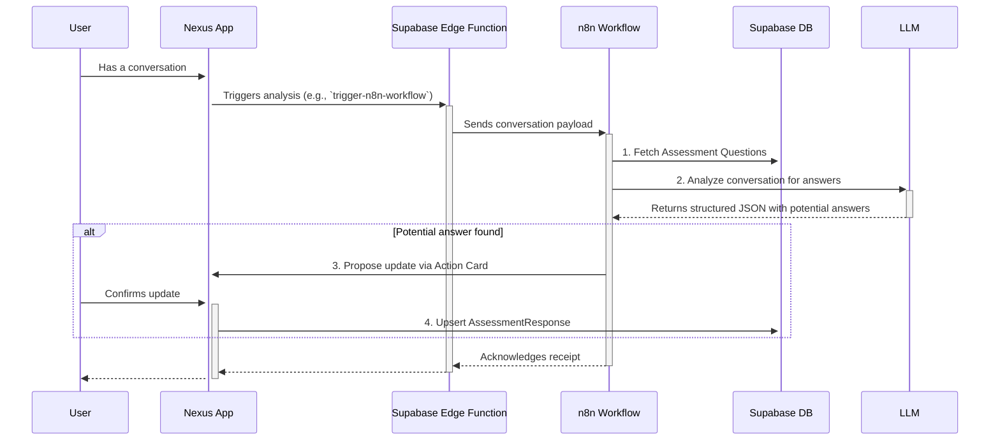

# Design Doc: Living Assessment via n8n Agent

**Pillar: 1, 2**

## 1. Overview

This document outlines the architecture for a system that allows the Nexus platform to act as a "living document," automatically identifying answers to assessment questions from user conversations and proposing updates. This moves the assessment from a static, point-in-time questionnaire to a dynamic, continuously updated profile of the user's business.

The core of this system will be an **n8n workflow** that functions as an asynchronous agent, triggered by conversations within the Nexus app.

## 2. Architecture

The system follows an event-driven, asynchronous pattern that leverages existing Supabase and n8n infrastructure.

### High-Level Flow Diagram

## 3. Component Breakdown

### a. Client-Side Trigger (Nexus App)

-   **Trigger Point:** A mechanism is needed to decide when a conversation is "complete" and ready for analysis. This could be after a user has been inactive in the chat for a certain period or when a chat session is closed.
-   **Invocation:** The client will call a Supabase Edge Function, `trigger-n8n-workflow`, passing the relevant context.

### b. Supabase Edge Function (`trigger-n8n-workflow`)

-   **Existing Function:** We will adapt the existing `trigger-n8n-workflow` function.
-   **Payload to n8n:** It will be responsible for securely calling the n8n webhook. The JSON payload will include:
    -   `company_id`: The user's company ID.
    -   `user_id`: The user's ID.
    -   `conversation_text`: The full transcript of the conversation to be analyzed.
    -   `workflow_id`: "living_assessment_agent"

### c. n8n Workflow: "Living Assessment Agent"

This is the core orchestration logic.

1.  **Trigger Node (Webhook):** Receives the payload from the Supabase function.
2.  **Fetch Questions (Supabase Node):** Executes a `SELECT * FROM public."AssessmentQuestion";` to retrieve all possible questions.
3.  **Analyze (LLM Node):**
    -   Constructs a prompt containing the `conversation_text` and the list of questions.
    -   Instructs the LLM to identify answers and return a JSON object like `{ "updates": [{ "question_id": "...", "value": "..." }] }`.
4.  **Check for Answers (IF Node):** Checks if the `updates` array from the LLM is empty. If so, the workflow ends.
5.  **Propose Update (HTTP Request Node):**
    -   If answers are found, this node calls back to a new Supabase function (e.g., `create-action-card`).
    -   This function will create an `ActionCard` in the UI, asking the user to confirm the update.
6.  **(Future) Wait for Confirmation:** A more advanced version could use n8n's "Wait" node to pause the workflow until the user responds to the action card.
7.  **Update Database (Supabase Node):** Once confirmation is received (via another webhook trigger from the Action Card), this node will perform an `UPSERT` on the `public."AssessmentResponse"` table.

### d. Database (Supabase)

-   We will use the existing `AssessmentQuestion` and `AssessmentResponse` tables.
-   We may need to add an `n8n_configurations` entry for this new workflow, containing the webhook URL and any necessary credentials.

## 4. Security Considerations

-   **RLS:** All database queries from n8n will be executed using a Supabase service role key that respects Row-Level Security, ensuring n8n can only access data it's authorized to.
-   **Webhook Security:** The n8n webhook will be protected by a secret token or API key passed in the authorization header from our Supabase function.
-   **User-in-the-Loop:** For safety and accuracy, the system will not update assessment data without explicit user confirmation via the Action Card. This is a critical guardrail.

## 5. Implementation Plan

1.  [ ] Configure a new workflow in n8n and get its webhook URL.
2.  [ ] Add the new workflow configuration to the `n8n_configurations` table in Supabase.
3.  [ ] Implement the logic in the Nexus client to trigger the `trigger-n8n-workflow` function.
4.  [ ] Build the n8n workflow with the steps outlined above.
5.  [ ] Create the `create-action-card` Supabase function and corresponding client-side UI component to render it.
6.  [ ] Implement the "confirmation" pathway that allows the Action Card to trigger the final database update.
7.  [ ] Write integration tests to ensure the end-to-end flow works as expected.

--- 