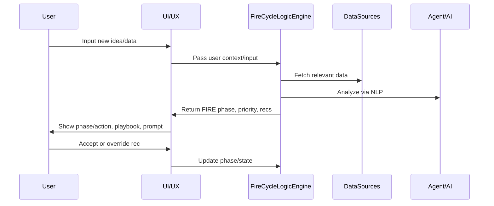

# FIRE CYCLE - Intelligent Contextual Analyzer

**FIRE CYCLE transforms Nexus into a context-aware, action-driving platform that helps users turn their goals, data, and insights into real, measurable results—automatically.**

Every user input becomes intelligent guidance, every challenge gets a proven solution, and every action drives toward clear outcomes.

## 🧠 Core Intelligence Architecture

### How Nexus Processes Every Input

**Every piece of user data (note, chat, data event, user request) is automatically analyzed and mapped to the FIRE cycle:**

1. **Intake & Analysis (NLP + Sentiment)**
   - Use NLP, entity extraction, and sentiment analysis on all user/context inputs
   - Determine if this is a *new thought, idea, or initiative* OR *related to an existing item*

2. **FIRE Classification & Routing**
   - **Focus**: Is this highlighting a new goal, challenge, or area of concern?
   - **Insight**: Does this surface new data, risks, or trends?
   - **Roadmap**: Is this proposing a plan, step, or sequence?
   - **Execute**: Is this an action, decision, or completion?

3. **Update/Create Logic**
   - **If new**: Create a new item in the appropriate FIRE phase, start tracking
   - **If update**: Attach/merge info to relevant active item, update phase as needed

4. **Surface Next Best Action**
   - After classification, immediately prompt user with the *next logical step* in the FIRE cycle

## 🎯 FIRE-Driven Solutions Playbooks

### Vision & Workflow

**Every common scenario, challenge, or opportunity in Nexus has an associated Solutions Playbook—framed around the FIRE Cycle:**

- **Focus:** How do we define the problem or goal?
- **Insight:** What key data, signals, or trends should the user know?
- **Roadmap:** What stepwise plan do successful users follow in this case?
- **Execute:** What specific actions, automations, or resources can Nexus deliver right now?

### Solution Playbook Integration

- **FIRE CYCLE logic is used to recommend and deliver solution playbooks for any problem, blocker, or opportunity detected.**
- **When user context matches a common challenge (e.g., "low sales response"), Nexus surfaces a structured playbook aligned with the user's current FIRE phase—so every recommendation is both actionable and personalized.**

### How Solutions Playbooks Work

1. **User context (data, input, or detected issue) is analyzed and classified using FIRE.**
2. **Nexus recommends the most relevant Solutions Playbook,** *matched to both* the user's FIRE phase *and* the type of problem/initiative.
3. **Each Playbook is modular:** It can surface checklists, tasks, automations, or delegate to experts—always mapped to FIRE, always with a "next action."
4. **AI/Agent can prompt at every phase:** "Based on your Focus and current Insight, here's a Roadmap you can follow. Ready to Execute the first step?"

### Benefits for Users & Platform

- **Clarity:** Users always know "where they are" and what the next logical step is.
- **Actionability:** Every playbook leads to concrete, system-driven actions or automations.
- **Personalization:** Advice, playbooks, and even agent tone adapt based on user's current FIRE context.
- **Continuous Learning:** System learns which playbooks/steps drive results and optimizes recommendations over time.

## 🤖 Intelligent Input Classification

- **All user inputs (notes, tasks, ideas, AI chats) are analyzed using NLP and sentiment analysis.**
- **The system determines if the input is a new initiative, update, or action, and maps it to the appropriate FIRE phase—ensuring nothing falls through the cracks.**

## 🔌 API & Agent Extensibility

- **The FIRE CYCLE meta-framework exposes hooks and APIs for internal agents and external systems to read, write, and react to FIRE state and analysis.**
- **3rd-party modules can plug in to provide phase-aware recommendations, actions, or playbooks.**

## 🎨 User Experience Integration

- **The current FIRE phase and priority actions are surfaced as a persistent tracker (overlay/widget), always showing "what matters now."**
- **All agent, AI, and system prompts are contextually aware of the user's FIRE phase—so advice is never generic.**

## 📖 User Story Example

1. **User types a note:** "Need to fix pipeline drop-off this month."
2. **NLP classifies this as a Focus on pipeline health.**
3. **FIRE logic scans recent sales data, finds low response rates.**
4. **Insight phase is triggered:** "Pipeline drop-off detected at stage 2."
5. **Roadmap is suggested:** "Recommended steps—review lead sources, automate outreach."
6. **User chooses to Execute:** "Enable automation, assign follow-up to team."
7. **All actions, progress, and outcomes tracked in the FIRE cycle for future learning and coaching.**

## 🔄 Sequence Flow



## 🏗️ Architecture Components

### Core Processing Engine

```typescript
// Main processor that analyzes every input
const processor = new FireCycleProcessor(userContext);
const result = await processor.processUserInput("I need to increase revenue by 20%");
```

### Intelligent Agent

```typescript
// AI agent that provides contextual responses
const agent = new FireCycleAgent(userContext);
const response = await agent.processInput("Revenue increased 25% this quarter");
```

### Solutions Playbooks

```typescript
// Get relevant playbooks for user context
const { recommendPlaybook } = useFireCyclePlaybooks();
const playbooks = await recommendPlaybook(userContext, currentPhase, detectedProblem);
```

### Enhanced Store

```typescript
// Zustand store with intelligent analysis
const { analysis, recommendations, updateUserContext } = useEnhancedFireCycle();
```

## 📊 Processing Flow

### 1. Entity Extraction
- **Goals**: "want to", "need to", "goal", "objective"
- **Challenges**: "problem", "issue", "struggling", "blocker"
- **Projects**: "project", "initiative", "working on"
- **Tasks**: "task", "action", "need to", "should"
- **Metrics**: Numbers with units, KPIs, percentages

### 2. Sentiment Analysis
- **Positive**: Optimistic, success indicators
- **Negative**: Problems, challenges, concerns
- **Neutral**: Planning, analysis, data
- **Urgency**: Critical, high, medium, low

### 3. Context Matching
- Links input to existing projects, goals, or challenges
- Determines if this is new or an update
- Calculates relevance scores

### 4. FIRE Phase Classification
- **Focus**: New goals, challenges, priorities
- **Insight**: Data discoveries, trends, learnings
- **Roadmap**: Planning, strategy, milestones
- **Execute**: Actions, decisions, completions

## 🎯 Intelligent Responses

### Focus Phase Responses
```
🎯 **New Focus Detected**: "Increase revenue by 20%"

This looks like a new goal or objective. Would you like to:
• Set this as your primary focus?
• Break it down into smaller objectives?
• Link it to existing projects?
```

### Insight Phase Responses
```
📊 **Data Insight**: "Revenue increased 25% this quarter"

This looks like a new data point or trend. Let's analyze:
• What does this metric tell us?
• What patterns are you seeing?
• How does this impact your goals?
```

### Roadmap Phase Responses
```
🗺️ **New Project Plan**: "Launch new feature"

This looks like a new project or initiative. Let's create a roadmap:
• What are the key milestones?
• What resources do you need?
• What's the timeline?
```

### Execute Phase Responses
```
⚡ **Action Item**: "Implement new pricing strategy"

This looks like an action or task. Let's execute:
• What's the first step?
• What resources do you need?
• How will you track progress?
```

## 📋 Solutions Playbooks Examples

### Sales Playbook: "Re-energize Sales Pipeline"
```json
{
  "problem": "Sales lead response rate is low",
  "focus": "Clarify target response KPIs and identify bottlenecks",
  "insight": "Identify stages with highest drop-off and analyze lead quality",
  "roadmap": [
    "Review Lead Sources",
    "Automate First-Touch Emails", 
    "Schedule Weekly Lead Review"
  ],
  "execute": [
    "Enable Lead Scoring Automation",
    "Assign Follow-up Tasks to Sales Team"
  ]
}
```

### Marketing Playbook: "Optimize Marketing Campaign"
```json
{
  "problem": "Marketing campaign performance is declining",
  "focus": "Identify underperforming campaigns and optimization opportunities",
  "insight": "Analyze campaign metrics and audience behavior patterns",
  "roadmap": [
    "Audit Current Campaigns",
    "A/B Test Key Elements"
  ],
  "execute": [
    "Implement Winning Variations"
  ]
}
```

### Product Playbook: "Launch New Product Feature"
```json
{
  "problem": "Need to launch a new feature effectively",
  "focus": "Define success metrics and target audience for the feature",
  "insight": "Analyze user needs and market opportunity",
  "roadmap": [
    "Define Success Metrics",
    "Plan Launch Strategy"
  ],
  "execute": [
    "Execute Launch Plan"
  ]
}
```

## 🔧 Integration Examples

### Analytics Page Integration
```typescript
import { useFireCycleAgent } from '@/core/fire-cycle/fireCycleAgent';

const AnalyticsPage = () => {
  const { processInput } = useFireCycleAgent(userContext);
  
  const handleMetricUpdate = async (metric: string) => {
    const response = await processInput(`Metric update: ${metric}`);
    // Update UI with intelligent analysis
  };
  
  return (
    <div>
      {/* Analytics content */}
      <FireCycleIntelligenceDemo />
    </div>
  );
};
```

### Projects Page Integration
```typescript
const ProjectsPage = () => {
  const { updateUserContext } = useEnhancedFireCycle();
  
  const handleProjectUpdate = (project: Project) => {
    updateUserContext({
      currentProjects: [project],
      // ... other context
    });
    
    // Trigger intelligent analysis
    const analysis = await logicEngine.analyzeContext();
    // Update recommendations
  };
  
  return (
    <div>
      {/* Projects content */}
      <IntelligentFireCycle />
    </div>
  );
};
```

### Solutions Playbooks Integration
```typescript
import { SolutionsPlaybookUI } from '@/core/fire-cycle/SolutionsPlaybookUI';

const Dashboard = () => {
  const { analysis } = useEnhancedFireCycle();
  
  return (
    <div>
      {/* Dashboard content */}
      <SolutionsPlaybookUI 
        userContext={userContext}
        currentPhase={analysis.currentPhase}
        detectedProblem={analysis.detectedProblem}
      />
    </div>
  );
};
```

## 🎨 UI Components

### FireCycleIntelligenceDemo
Interactive demo showing how the system processes different types of inputs:

```typescript
import { FireCycleIntelligenceDemo } from '@/core/fire-cycle/FireCycleIntelligenceDemo';

// Shows real-time processing of user inputs
<FireCycleIntelligenceDemo />
```

### SolutionsPlaybookUI
Comprehensive playbook interface with interactive workflows:

```typescript
import { SolutionsPlaybookUI } from '@/core/fire-cycle/SolutionsPlaybookUI';

// Displays recommended playbooks and guided workflows
<SolutionsPlaybookUI 
  userContext={userContext}
  currentPhase={currentPhase}
  detectedProblem={detectedProblem}
/>
```

### IntelligentFireCycle
Main FIRE cycle component with intelligent analysis:

```typescript
import { IntelligentFireCycle } from '@/core/fire-cycle/IntelligentFireCycle';

// Displays intelligent FIRE cycle data
<IntelligentFireCycle />
```

### FireCycleIntegration
Integration component for any page:

```typescript
import { FireCycleIntegration } from '@/core/fire-cycle/FireCycleIntegration';

// Adds FIRE cycle intelligence to any page
<FireCycleIntegration />
```

## 📈 Data-Driven Analysis

### User Context Analysis
- **Role & Experience**: Adapts recommendations based on user's role and experience level
- **Department & Industry**: Tailors suggestions to specific business context
- **Company Stage**: Adjusts advice for startup vs. enterprise needs

### Intelligent Recommendations
- **Confidence Scoring**: Each recommendation includes confidence level
- **Priority Ranking**: Suggestions are prioritized by impact and effort
- **Context Awareness**: Recommendations adapt to current user context

### Continuous Learning
- **Pattern Recognition**: Learns from user interactions and outcomes
- **Feedback Integration**: Incorporates user feedback to improve suggestions
- **Performance Tracking**: Monitors effectiveness of recommendations

## 🚀 Best Practices

### 1. Context Updates
Always update user context when relevant data changes:

```typescript
const { updateGoals, updateProjects, updateMetrics } = useEnhancedFireCycle();

// Update context when data changes
updateGoals(newGoals);
updateProjects(newProjects);
updateMetrics(newMetrics);
```

### 2. Intelligent Prompts
Use the agent for intelligent input processing:

```typescript
const { processInput } = useFireCycleAgent(userContext);

// Process any user input intelligently
const response = await processInput(userInput);
console.log(response.suggestions); // Get contextual suggestions
```

### 3. Solutions Playbooks
Use playbooks for structured problem-solving:

```typescript
const { recommendPlaybook } = useFireCyclePlaybooks();

// Get relevant playbooks for current challenge
const playbooks = await recommendPlaybook(userContext, currentPhase, detectedProblem);
```

### 4. Real-time Analysis
Trigger analysis when context changes:

```typescript
const { triggerAnalysis } = useEnhancedFireCycle();

// Trigger intelligent analysis
const analysis = await triggerAnalysis();
```

### 5. Integration Points
Add FIRE cycle intelligence to key pages:

```typescript
// Analytics page
<FireCycleIntelligenceDemo />

// Projects page  
<IntelligentFireCycle />

// Solutions page
<SolutionsPlaybookUI />

// Dashboard
<FireCycleIntegration />
```

## 🔄 FIRE Cycle Flow

### Focus → Insight → Roadmap → Execute

1. **Focus**: Identify goals, challenges, and priorities
2. **Insight**: Analyze data, trends, and learnings
3. **Roadmap**: Plan strategies, milestones, and timelines
4. **Execute**: Take action, track progress, and complete

### Continuous Intelligence
- Every input is processed through this cycle
- Context is continuously updated
- Recommendations adapt in real-time
- Users get intelligent guidance at every step

## 🎯 Key Benefits

### For Users
- **Automatic Organization**: No need to manually categorize thoughts
- **Intelligent Guidance**: Get contextual suggestions and next steps
- **Structured Problem-Solving**: Solutions playbooks provide step-by-step guidance
- **Continuous Learning**: System adapts to your patterns and preferences
- **Actionable Insights**: Every input becomes actionable intelligence

### For Developers
- **Modular Architecture**: Easy to integrate into any page
- **Type Safety**: Full TypeScript support with proper types
- **Extensible**: Easy to add new analysis capabilities and playbooks
- **Performance**: Efficient processing with caching and optimization

### For Business
- **Data-Driven Decisions**: Every input contributes to business intelligence
- **Improved Productivity**: Users get intelligent guidance and automation
- **Better Outcomes**: Structured approach to goals and execution
- **Scalable Intelligence**: System learns and improves over time
- **Proven Solutions**: Playbooks based on successful business practices

## 🛠️ Design Conventions

- **All FIRE phase recommendations must include a confidence level and supporting evidence for transparency.**
- **System must allow user override of phase if misclassification is suspected.**
- **All analysis logic is modular and testable.**
- **All playbooks must include time estimates, success metrics, and prerequisite checks.**
- **All user-facing recommendations must be actionable with clear next steps.**

---

**FIRE CYCLE transforms Nexus from a simple app into an intelligent business advisor that understands context, provides guidance, and delivers proven solutions for every challenge.** 